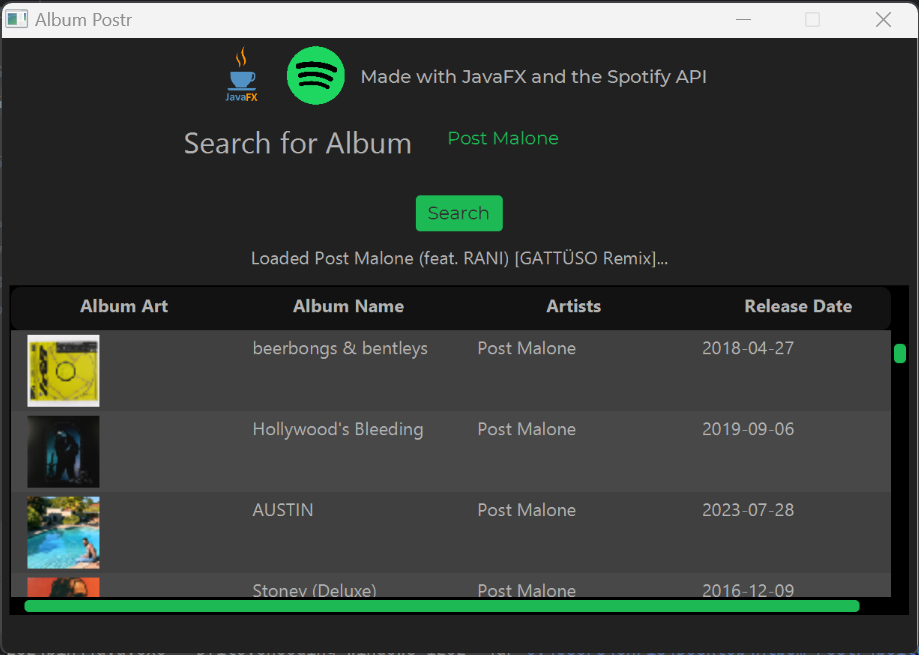
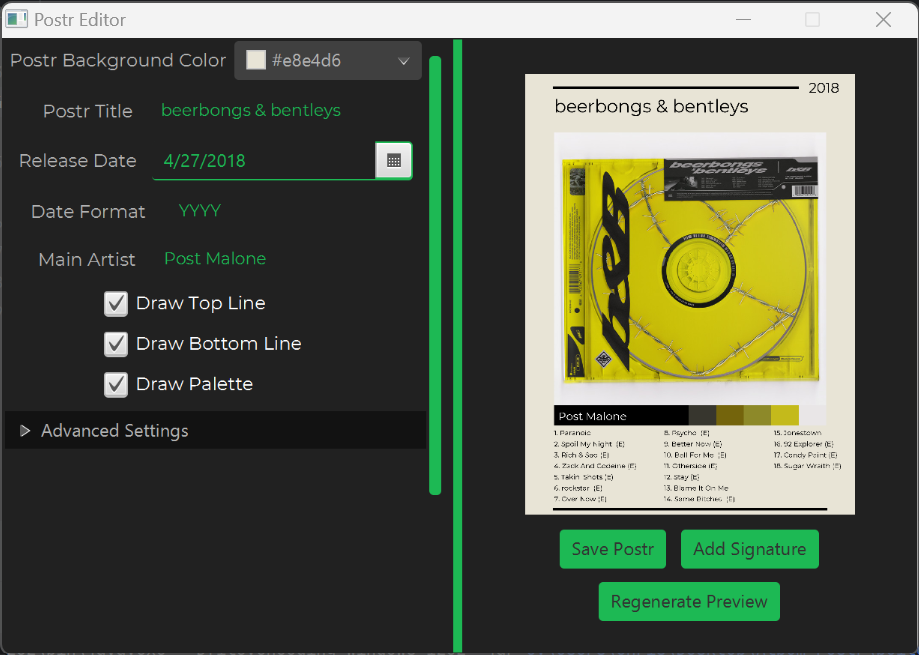
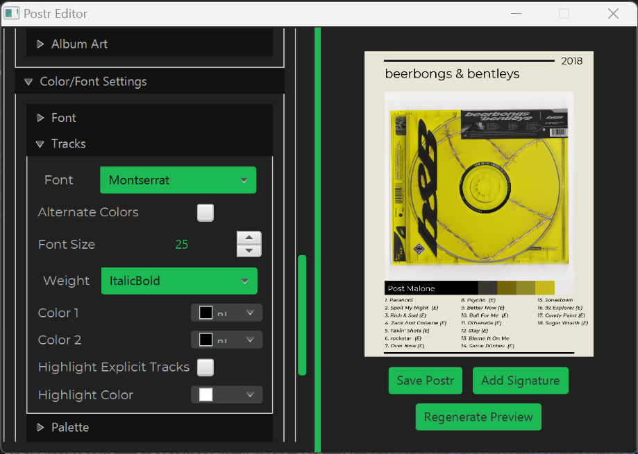

<!-- Improved compatibility of back to top link: See: https://github.com/othneildrew/Best-README-Template/pull/73 -->
<a name="readme-top"></a>
<!--
*** Thanks for checking out the Best-README-Template. If you have a suggestion
*** that would make this better, please fork the repo and create a pull request
*** or simply open an issue with the tag "enhancement".
*** Don't forget to give the project a star!
*** Thanks again! Now go create something AMAZING! :D
-->


<!-- PROJECT SHIELDS -->
<!--
*** I'm using markdown "reference style" links for readability.
*** Reference links are enclosed in brackets [ ] instead of parentheses ( ).
*** See the bottom of this document for the declaration of the reference variables
*** for contributors-url, forks-url, etc. This is an optional, concise syntax you may use.
*** https://www.markdownguide.org/basic-syntax/#reference-style-links
-->
[![Contributors][contributors-shield]][contributors-url]
[![Forks][forks-shield]][forks-url]
[![Stargazers][stars-shield]][stars-url]
[![Issues][issues-shield]][issues-url]
[![MIT License][license-shield]][license-url]
[![LinkedIn][linkedin-shield]][linkedin-url]


<!-- PROJECT LOGO -->
<br />
<div align="center">
  <a href="https://github.com/MEuph/album-postr">
    
  </a>

<h3 align="center">Album Postr</h3>

  <p align="center">
    An app for generating album posters that include an author's signature (if available), the color palette of the album art, the names of the songs in the album, and the year the album was released
    <br />
    <br /
    <a href="https://github.com/MEuph/album-postr/issues">Report Bug</a>
    ·
    <a href="https://github.com/MEuph/album-postr/issues">Request Feature</a>
  </p>
</div>


<!-- TABLE OF CONTENTS -->
<details>
  <summary>Table of Contents</summary>
  <ol
    <li>
      <a href="#getting-started">Getting Started</a>
      <ul>
        <li><a href="#prerequisites">Prerequisites</a></li>
      </ul>
    </li>
    <li><a href="#usage">Usage</a></li>
    <li><a href="#contributing">Contributing</a></li>
    <li><a href="#license">License</a></li>
    <li><a href="#contact">Contact</a></li>
    <li><a href="#acknowledgments">Acknowledgments</a></li>
  </ol>
</details>

<!-- GETTING STARTED -->
## Getting Started

This is an example of how you may give instructions on setting up your project locally.
To get a local copy up and running follow these simple example steps.

### Prerequisites

* [Java 8](https://www.java.com/download/ie_manual.jsp)
* ***For Developers***: [JDK 8u202](https://www.oracle.com/java/technologies/javase/javase8-archive-downloads.html)
### For Developers

1. Create an API key and secret at [The Spotify Developer Dashboard](https://developer.spotify.com/dashboard)
2. Clone the repo
   ```sh
   git clone https://github.com/MEuph/album-postr.git
   ```
3. Install IntelliJ and open build.gradle as a project file
4. Enter your API information in `dev.chrismharris.main.Keys.java` 
  ```java
  public static final String CLIENT_ID = "<YOUR_ID_HERE>";
  public static final String CLIENT_SECRET = "<YOUR_SECRET_HERE>";
  ```

<p align="right">(<a href="#readme-top">back to top</a>)</p>


<!-- USAGE EXAMPLES -->
## Usage








<!--_For more examples, please refer to the [Documentation](https://example.com)_-->

<p align="right">(<a href="#readme-top">back to top</a>)</p>


<!-- ROADMAP
## Roadmap

- [ ] Feature 1
- [ ] Feature 2
- [ ] Feature 3
    - [ ] Nested Feature

See the [open issues](https://github.com/github_username/repo_name/issues) for a full list of proposed features (and known issues).

<p align="right">(<a href="#readme-top">back to top</a>)</p>-->


<!-- CONTRIBUTING -->
## Contributing

Contributions are what make the open source community such an amazing place to learn, inspire, and create. Any contributions you make are **greatly appreciated**.

If you have a suggestion that would make this better, please fork the repo and create a pull request. You can also simply open an issue with the tag "enhancement".
Don't forget to give the project a star! Thanks again!

1. Fork the Project
2. Create your Feature Branch (`git checkout -b feature/AmazingFeature`)
3. Commit your Changes (`git commit -m 'Add some AmazingFeature'`)
4. Push to the Branch (`git push origin feature/AmazingFeature`)
5. Open a Pull Request

<p align="right">(<a href="#readme-top">back to top</a>)</p>


<!-- LICENSE -->
## License

Distributed under the MIT License. See `LICENSE.txt` for more information.

<p align="right">(<a href="#readme-top">back to top</a>)</p>


<!-- CONTACT -->
## Contact

Chris Harris - [LinkedIn]([https://twitter.com/twitter_handle](https://www.linkedin.com/in/christopher-harris-73b279231/)) - christopher.matthew.harris02@gmail.com

Project Link: [https://github.com/MEuph/album-postr](https://github.com/MEuph/album-postr)

<p align="right">(<a href="#readme-top">back to top</a>)</p>


<!-- ACKNOWLEDGMENTS -->
## Acknowledgments

* [Spotify API Wrapper for Java](https://github.com/spotify-web-api-java/spotify-web-api-java)
* [Color Thief](https://github.com/SvenWoltmann/color-thief-java) by [Sven Woltmann](https://github.com/SvenWoltmann/)

<p align="right">(<a href="#readme-top">back to top</a>)</p>


<!-- MARKDOWN LINKS & IMAGES -->
<!-- https://www.markdownguide.org/basic-syntax/#reference-style-links -->
[contributors-shield]: https://img.shields.io/github/contributors/MEuph/album-postr.svg?style=for-the-badge
[contributors-url]: https://github.com/MEuph/album-postr/graphs/contributors
[forks-shield]: https://img.shields.io/github/forks/MEuph/album-postr.svg?style=for-the-badge
[forks-url]: https://github.com/MEuph/album-postr/network/members
[stars-shield]: https://img.shields.io/github/stars/MEuph/album-postr.svg?style=for-the-badge
[stars-url]: https://github.com/MEuph/album-postr/stargazers
[issues-shield]: https://img.shields.io/github/issues/MEuph/album-postr.svg?style=for-the-badge
[issues-url]: https://github.com/MEuph/album-postr/issues
[license-shield]: https://img.shields.io/github/license/MEuph/album-postr.svg?style=for-the-badge
[license-url]: https://github.com/MEuph/album-postr/blob/master/LICENSE
[linkedin-shield]: https://img.shields.io/badge/-LinkedIn-black.svg?style=for-the-badge&logo=linkedin&colorB=555
[linkedin-url]: https://linkedin.com/in/christopher-harris-73b279231
[product-screenshot1]: screenshot1.png
[product-screenshot2]: screenshot2.png
[product-screenshot3]: screenshot3.png

# Album Postr
An app for generating album posters that include an author's signature (if available), the color palette of the album art, the names of the songs in the album, and the year the album was released

# To Use
To use Album Postr, make sure you are on the latest version of Java 8, and that your installation of Java includes JavaFX. It should by default. Then make sure you have a decent internet connection, and you're ready to roll! Check the releases folder for the latest version

# For Developers
API keys are not included in the source code. To contribute to album-postr you will need to generate your own. Please visit [The Spotify Developers Page](https://developer.spotify.com/) to learn more

To add your keys, simply create a new class called `Keys.java` in the `dev.chrismharris.main` package and add the following code

# External Libraries Used
- [Color Thief](https://github.com/SvenWoltmann/color-thief-java) by [Sven Woltmann](https://github.com/SvenWoltmann/)
- [Java Wrapper for Spotify API](https://github.com/spotify-web-api-java/spotify-web-api-java) by [Michael Thelin](https://github.com/thelinmichael)
